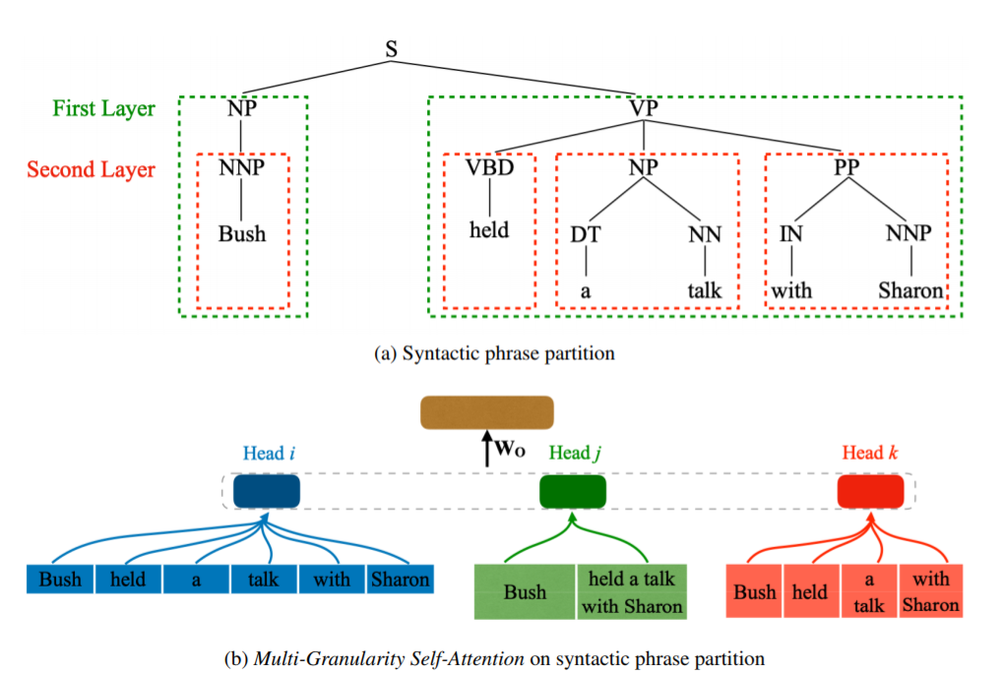
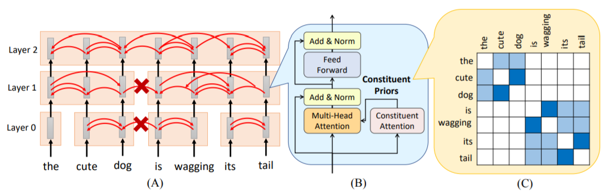

[TOC]

# 百变Self-Attention 

#### 导读

维护了一个NLP论文集仓库：<https://github.com/PengboLiu/NLP-Papers>

**本文中，self-attention networks简记为SANs**

首先是EMNLP 2019中，腾讯AI LAB的三篇关于SANs的论文。

------

#### [Self-Attention with Structural Position Representations](https://arxiv.org/pdf/1909.00383.pdf)

在Transformer中，SANs本身不能表示句子结构的，句子的序列信息是靠“position encoding”得到的。

本文对此进行改进，在SANs中融合了结构性的位置表示信息，以此增强SANs对句子潜在结构的建模能力。当然并没有舍弃原有的position encoding，**本文是把序列信息和结构信息一并使用**。

**结构化位置表示：**position encoding是根据句子中单词的实际位置建模，而本文引入了依存句法树表示单词之间的关系。直觉上来说，这种方法能挖掘出更多关于句子中各个词语之间的依存信息。

本文介绍了两种位置：绝对结构位置和相对结构位置（使用Stanford Parser）

- 绝对结构位置：把主要动词作为原点，然后计算依存树上每个单词到原点的距离；

- 相对结构位置：根据以下规则计算每两个单词之间的距离

  - 在依存树的一条边上，两个单词的绝对结构位置之差就是相对结构位置；

  - 如果不在同一条边，两个单词的绝对结构位置之和乘1（两个单词在句子中正序）或-1（两个单词在句子中正序逆序）或0（同一个单词）

最后，序列绝对位置和结构绝对位置通过非线性函数结合在一起得到绝对位置的表示。至于相对位置，因为每个时间步的单词都不同，方法和绝对位置表示也不一样。这里，作者参考了[Self-Attention with Relative Position Representations](https://arxiv.org/pdf/1803.02155.pdf)中的方法。

作者在NMT和 Linguistic Probing Evaluation两个任务上进行试验，结果表明无论是相对结构位置还是绝对结构位置都能更好地在句法和语义层面上建模，从而达到更好的效果。

------

#### [Multi-Granularity Self-Attention for Neural Machine Translation](https://arxiv.org/pdf/1909.02222.pdf)

上一篇论文是利用Parser生成依存句法树进而改变SANs的输出，这篇论文则在SANs的结构做了一些改动，目的类似，也是为了增加句子的句法结构信息。

多粒度的Self-Attention简称为MG-SA，结合多头注意力和短语建模。一方面，在多头注意力中拿出几个“头”在N元语法和句法维度对短语建模；然后，利用短语之间的相互作用增强SANs对句子结构建模的能力（还是structure modeling）。

本文的motivation有两方面：

1. 和上一篇论文类似，考虑短语模式学习句子的潜在结构；
2. 最近很多论文表明，SANs中很多“head”并没有被充分利用，这样何不试试把一些“head”做别的事情从而改善SANs的性能；

改进后的MG-SA如下：
$$
\mathbf{H}_{g}=F_{h}(\mathbf{H})
$$

$$
\mathbf{Q}^{h}, \mathbf{K}^{h}, \mathbf{V}^{h}=\mathbf{H} \mathbf{W}_{Q}^{h}, \mathbf{H}_{g} \mathbf{W}_{K}^{h}, \mathbf{H}_{g} \mathbf{W}_{V}^{h}
$$

$$
\mathbf{O}^{h}=\operatorname{ATT}\left(\mathbf{Q}^{h}, \mathbf{K}^{h}\right) \mathbf{V}^{h}
$$

$$
\mathrm{MG}-\mathrm{SA}(\mathbf{H})=\left[\mathbf{O}^{1}, \ldots, \mathbf{O}^{\mathrm{N}}\right]
$$

$ATT$ 就是经典的Self-Attention，无需多言。可以看出，主要的改动在于 $\mathbf{H}_{g}​$（文章称之为生成的短语级记忆）。计算方法也就是文章提到的“Multi-Granularity”表示：

**多粒度表示(Multi-Granularity Representation)**

首先是得到短语划分并对其合成，如图（a），然后短语标签监督和短语交互可以进一步增强短语表示在结构上的建模能力。最终得到的MG-SA如图（b）。

- **短语划分（Phrase Partition）**：句子划分成若干个不重叠的长度为n个单词的短语。此外，又提出了句法级的短语划分（当然也要靠句法树），得到的短语输入为 $P_{\mathbf{x}}=\left(p_{1}, \dots, p_{M}\right)​$；

- **合成策略（Composition Strategies）**：$g_m = COM(p_m)​$ ，$COM​$一般是CNN、RNN或者是SANs；

- **短语标签监督（Phrase Tag Supervision）**：得到的 $g_m$，我们再使用它预测短语的标签（就是NP、VP、PP这些）

  预测方法（softmax）和损失函数（负对数似然）如下：
  $$
  p_{\theta_{i}}=\operatorname{softmax}\left(W_{t} g_{i}+b_{t}\right), i=1, \ldots, M
  $$

  $$
  \mathcal{L}_{t a g}=-\sum_{i=1}^{M} t_{i} \log p_{\theta_{i}}\left(t_{i}\right)
  $$

- **短语间的交互（Phrase Interaction ）**：想让句子的短语得到交互，直觉肯定是要引入循环式的结构（$REC$），那LSTM当之无愧了。本文采用了ICLR2019提出的Ordered Neurons LSTM （ON-LSTM，关于ON-LSTM的介绍，可以参考苏建林的博客 <https://kexue.fm/archives/6621>）。到此为止，我们终于得到了$H_g​$。
  $$
  H_g = REC(G_X)
  $$
  

**训练和实验**：

- 训练时的损失函数需要把刚才定义的短语标签预测损失加起来；
- 在机器翻译任务上做了若干组实验，并进行了可视化分析；
-  完成了 [Does string-based neural mt learn source syntax](https://www.isi.edu/natural-language/mt/emnlp16-nmt-grammar.pdf) 中的任务来评估MG-SA多粒度短语建模的能力。

------

#### [Towards Better Modeling Hierarchical Structure for Self-Attention with Ordered Neurons](https://arxiv.org/pdf/1909.01562.pdf)

看论文标题就知道，又是一篇对SANs结构改进的文章，而且也使用了刚才提到的ON-LSTM。本文的贡献有二：

1. 层次结构（要区别与上文的句法结构）可以更好地对SANs建模；
2. 证明了ON-LSTM对有助于NMT任务；

这里，我们主要看看对SANs的改进。
$$
\begin{array}{l}{\mathbf{H}_{\mathrm{RNNs}}^{K}=\mathrm{ENC}_{\mathrm{RNNS}}(\mathbf{X})} \\ {\mathbf{H}_{\mathrm{SANs}}^{L}=\mathrm{ENC}_{\mathrm{SANs}}\left(\mathbf{H}_{\mathrm{RNNS}}^{K}\right)}\end{array}
$$
其实就是输入先使用RNNs编码，然后得到的输出再用SANs编码。这里的RNN就是ON-LSTM，具体细节还是看苏神的博客就好。

最后，也没有直接去利用得到的SANs的输出，而是使用 Short-Cut Connection（就是类似Transformer中residual connection的结构）。也算是取之Transformer，用之Transformer。
$$
\widehat{\mathbf{H}}=\mathbf{H}_{\mathrm{ON}-\mathrm{L} \mathrm{STM}}^{K}+\mathbf{H}_{\mathrm{SANS}}^{L}
$$

------

#### [Tree Transformer: Integrating Tree Structures into Self-Attention](https://arxiv.org/pdf/1909.06639.pdf)

同样是来自EMNLP2019的paper，这篇paper对SANs的改进主要是在两个相邻单词之间增加了一个“Constituent Attention”模块，从而达到树结构的效果（也就是 Tree Transformer）。

图（A）是Tree Transformer的结构。以图为例，输入“the cute dog is wagging its tail”。在layer0，cute和dog组成一个“Constituent”，its和tail组成一个“Constituent”。在layer1，两个相邻的“Constituent”可能融合在一起，所以“Constituent”的尺寸是越来越大的，到最顶层就只有一个“Constituent”了。那么怎么划分一个“Constituent”呢？

文章引入了“Constituent Attention”、“ Neighboring Attention”和“Hierarchical Constraint”的概念。

首先是Neighboring Attention，q和k和经典的transformer结构中的意义相同。
$$
s_{i, i+1}=\frac{q_{i} \cdot k_{i+1}}{d}
$$

$$
p_{i, i+1}, p_{i, i-1}=\operatorname{softmax}\left(s_{i, i+1}, s_{i, i-1}\right)
$$

$$
\hat{a}_{i}=\sqrt{p_{i, i+1} \times p_{i+1, i}}
$$

得到的 $\hat{a}_{i}​$还需“Hierarchical Constraint”的处理，至于为什么后面会说。
$$
a_{k}^{l}=a_{k}^{l-1}+\left(1-a_{k}^{l-1}\right) \hat{a}_{k}^{l}
$$
最后一步，终于要计算“Constituent Attention”了！
$$
C_{i, j}=\prod_{k=i}^{j-1} a_{k}
$$
$C_{i, j}$由 $i，j$ 之间的 $a_k$ 连乘得到。不过这么做有个问题就是某个$a_k$特别小的话，连乘起来的结果会趋近于0，所以我们用对数和的形式代替它：
$$
C_{i, j}=e^{\sum_{k=i}^{j-1} \log \left(a_{k}\right)}
$$
“Constituent Attention”要怎么去用呢？并不是单独作为一个结构，而是在原有的attention概率分布前乘上这个“Constituent Attention”就好了。
$$
E=C \odot \operatorname{softmax}\left(\frac{Q K^{T}}{d}\right)
$$
在这，解释一下“Hierarchical Constraint”：因为attention的每一个layer，都不小于前一个layer，为了保证这种层次性，我们需要添加这样一种限制，使得每一层的“Constituent Attention”都要大于上一层的。

图（B）是整个Tree Transformer的结构，图（C）是Constituent Attention的热力图，可以看到，确实有了分块的效果。

值得一提的是，文章还单独一节介绍了Tree Transformer中的Neighboring Attention，可以看做一种无监督的parsing，也算是意料中的收货吧。

------

