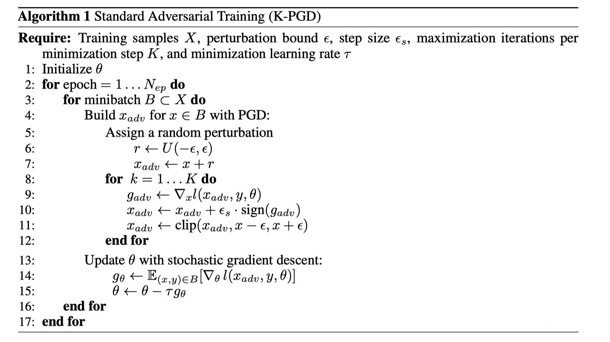
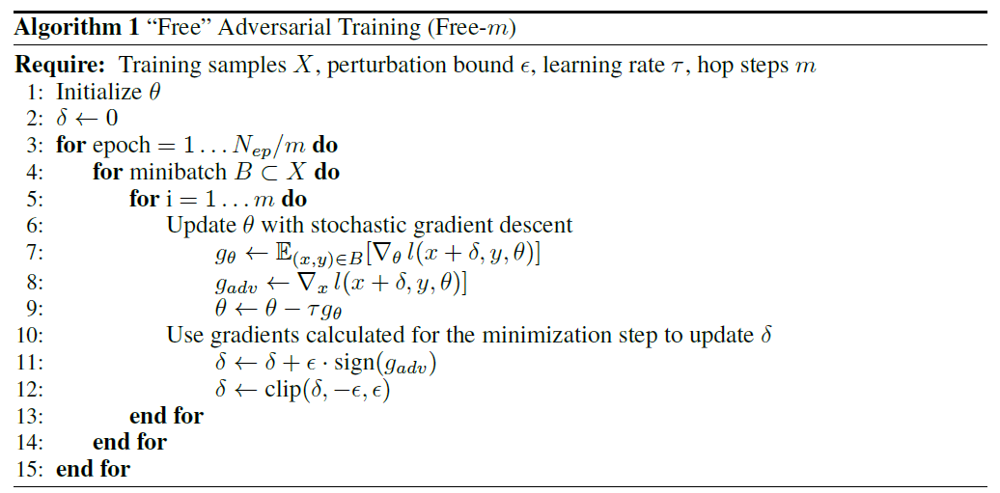

# NLP中的对抗文本“攻防”

开篇之前，我们要明确一下对抗样本（adversarial examples）的概念：对输入样本故意添加一些人无法察觉的细微的干扰，导致模型预测出一个错误的输出。这里，细微的干扰（perturbation）被视为对抗样本。那么制造一些对抗样本检测模型是否具有鲁棒性就称之为“攻”（adversarial attack），对模型进行一些改动以应付这些攻击的办法就是“防”（adversarial training）。

研究对抗样本和对抗训练有什么用呢？我们在做研究的时候总是在一些标准的数据集进行实验，但是真正到工业界落地使用，测试环境往往会有很多脏数据，这些数据可能和正确的数据差别很小很小，人类很容易就能猜出数据背后的意思，但是我们训练好的模型却不能很好的进行识别，从而导致误识别、误分类。本文将以若干篇近期发表的文章为例，介绍文本中的对抗样本生成和防御。

## 如何产生对抗文本？

在图像领域，我们改动几个像素点就可以产生对抗样本。但是在文本中就行不通了，我们要保证改动前后语义大体相似，这就要求我们不能随便增删改某一个字（比如把一句话中的“好”改成“坏”，极可能会对句子的情感造成影响，这时就不能称之为一个好的对抗样本了）。在这里，我们既可以在词向量维度添加扰动，也可以离散地在文本层面上添加扰动。这里我选取了最近的几篇论文来分享一下生成对抗文本的不同方法。

#### [Is BERT Really Robust? A Strong Baseline for Natural Language Attack on Text Classification and Entailment](https://arxiv.org/pdf/1907.11932.pdf) （AAAI 2020）

作者开源了一个生成对抗文本的工具 **TextFooler**（<https://github.com/jind11/TextFooler>）。

首先，作者把生成对抗样本这一问题重新定义了一下：
$$
F\left(X_{a d v}\right) \neq F(X), \text { and } \operatorname{Sim}\left(X_{a d v}, X\right) \geq \epsilon
$$
我们的目的是要找到符合这样条件的样本：模型预测和原样本不同，但是语义却又和原样本相似。作者设计了两阶段的方法寻找我们需要的对抗样本。

**第一步： 单词重要程度排序**

一句话中，主要靠某些单词决定文本的类别。我们在这里要选择最能影响结果的单词。怎么找到这样的单词？作者设计了一个打分函数，根据每个单词的得分排序就好了。我在这里用语言叙述一下好了：所谓的分数来自于全连接后的 $softmax$ 函数输出结果，如果当前词删去前后，模型预测结果不变，那当前词的得分就是模型输出结果前后的差；如果当前词删去前后模型预测结果变了，说明这个词还是非常关键的，这时当前词的得分等于正确类别前后预测分数的差加上错误类别前后预测的差。

作者还做了一些后处理，如去除停用词。

**第二步：Word Transformer **

找到了最应该被替换掉的单词，下一步自然是寻找换上来什么词。在文本中，需要满足三点：

1. 语义和原词相近：不需要解释吧，起码意思得一致，不然弄出来的对抗样本有什么意义呢；
2. 符合上下文：文本特殊就特殊在这，我们要让换上来的词不那么“违和”；
3. 使模型的结果是错的：一个好的对抗样本的目的就是迷惑模型，所以这一条也是自然而然的；

作者为了寻找合适的替换词，采取了以下步骤：

- 同义词提取：embedding是衡量语义的好工具， 对整个embedding词典求和被替换词语义相似的词。比如，50个相似度大于0.7的；
- 词类（POS）检查：在候选单词中，为了保证语法顺畅，做一个筛选：选择和原单词词类相同的词；
- 语义相似度检查：为了保证前后两句话语义一致，使用 [Universal Sentence Encoder](https://arxiv.org/pdf/1803.11175.pdf) 把两个句子编码到高维空间然后计算相似度，大于阈值的加入到 最终候选集中；
- 生成对抗样本：在候选集中，如果有对抗样本的模型预测和之前不同的，在其中选一个语义相似度和之前最大的，如果没有，选一个预测输出分数最低的；

至此，我们就找到了这句话的对抗样本。

#### [On the Robustness of Self-Attentive Models](https://www.aclweb.org/anthology/P19-1147.pdf) （ACL 2019）

本文提出了一些生成对抗文本的方法，并证明了基于self attention的模型（比如Transformer、BERT）比其他模型鲁棒性更高。这里主要介绍一下文章提到的对抗文本的生成方法。

##### Attack方法（1-3是之前的方法，4和5是本文的工作）

1. Random Attack：顾名思义，在词表中随机找到一个词进行替换；
2.  List-based Attack：在近义词表中找到句子中每个词的替换，目的是让模型预测到错误的标签。近义词可以使用embedding计算相似度得到；
3. GS-GR：Greedy Select + Greedy Replace，名字就很粗暴，对一句话中每个词替换成padding，检测哪个词是”weak spot“，也就是最容易被攻击的。然后我们在词典中选择一个词去替换改词，直到模型预测错误标签为止；
4. Greedy Select + Embedding Constraint：GS-GR方法并没有考虑语义，可能把语句变成意义完全相反的句子。比如：“this is a good restaurant” 转变为“this is a bad restaurant.”。确实预测出错误标签，但是语义也完全改变了，这并不是我们的本意。作者的解决方法：使用句子级别的embedding作为约束。也就是说，替换了一个词，改动前后的sentence embedding不会变化太多。这种方法在方法三的基础上需要找到一个使改动前后的sentence embedding变化最小的单词；
5. Attention-based Select：基于attention的模型，改变attention score最高或最低的单词会影响模型的预测，根据这一点把对应的单词做替换。可以随机替换，文章称为AS-GR，也可以利用前面那种计算embedding相似度的方法，文章称之为AS-EC；

## 如何进行对抗训练？

对抗训练目前有很多针对图像和文本的研究，本文选择几篇文章展开对比一下不同的对抗训练方法。

一般来说，我们把对抗训练过程抽象成为一个$Min-Max​$问题（Aleksander Madry，ICLR 2017）：

$$min_θρ(θ)\;,\;where\; ρ(θ) = E_{(x,y) ~ D}[max_{δ∈S} L(θ, x + δ, y) ]​$$

1. 内部的最大化问题：找到一个对抗样本，使得损失函数的结果尽可能的大，也就是模拟一个攻击过程，选择攻击性最强的样本，这种攻击方法称为"投影梯度下降"（projected gradient descent, PGD），重复K次就是K-PGD。如果在自然语言中，就是对词嵌入加一个数值的扰动，但是又不能太离谱，需要加一些正则化的约束；
2. 外部的最小化问题：目的是找到一组网络参数，让受到攻击的样本损失函数输出尽可能小，也就是用对抗样本训练一个更加稳定的网络；

看算法流程图可能会更清晰一点。

但是$Min-Max​$方法计算比较复杂，可以看出输入一组数据要进行多次求导反向传播更新参数，据说MNIST这种数据集也要训练一晚上，于是诞生了一些改进其方法的工作。

#### [Adversarial Training for Free!](https://arxiv.org/abs/1904.12843) （NeurIPS 2019）

“Free”的意思是对抗训练不会产生额外的操作就可以完成对抗训练。

能达到这种效果的基本是思想是：最大化部分和最小化部分共享梯度。在整个训练过程中$min​$和$max​$的损失函数、网络结构是相同的，反向传播过程也是相同的，网络中各个结点的偏导数也是相同的，如果求导的时候输入和模型权重相同，最大化和最小化的梯度值也相同。有了这种理论基础就可以共享梯度了。作者提供了实现代码。

[PyTorch实现](https://github.com/mahyarnajibi/FreeAdversarialTraining) 

[TensorFlow实现](https://github.com/ashafahi/free_adv_train)

算法流程图如下：

对比之前的K-PGD算法的流程我们可以明显发现，这里把$min$和$max$的参数更新放在一起了，也就自然而然加快了对抗训练速度。

这里m的取值一般<10，因为迭代次数过多产生的对抗样本可能和原样本相去甚远了。epoch也要调小一点，比如在K-PGD中模型参数迭代了N次，这里我们大致算一下保证“FREE”算法也能迭代参数N次就可以了（一个minibatch里参数会更新m次），所以一个相对小的epoch超参数，可以达到和K-PGD相似的鲁棒性，大大减少了对抗训练的时间。论文还提到可以适当加大模型尺寸来学习到更鲁棒的模型。